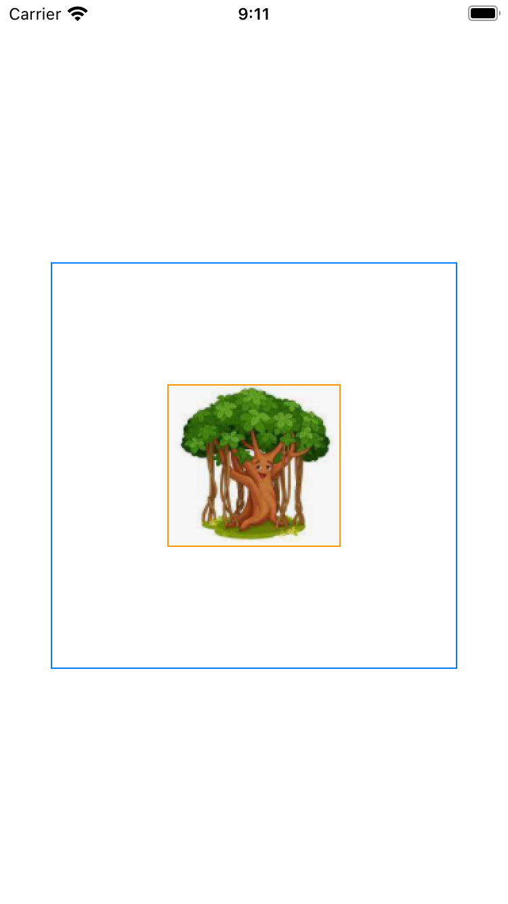
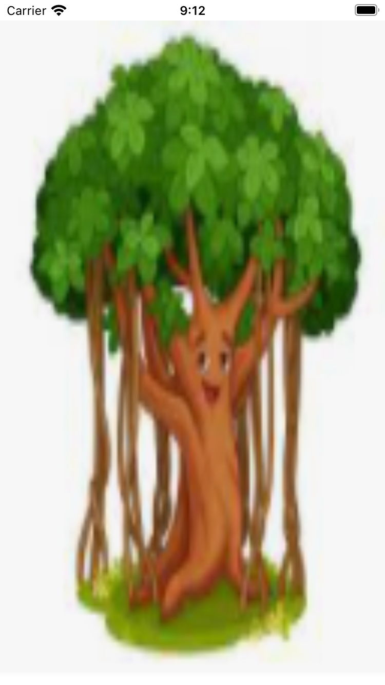
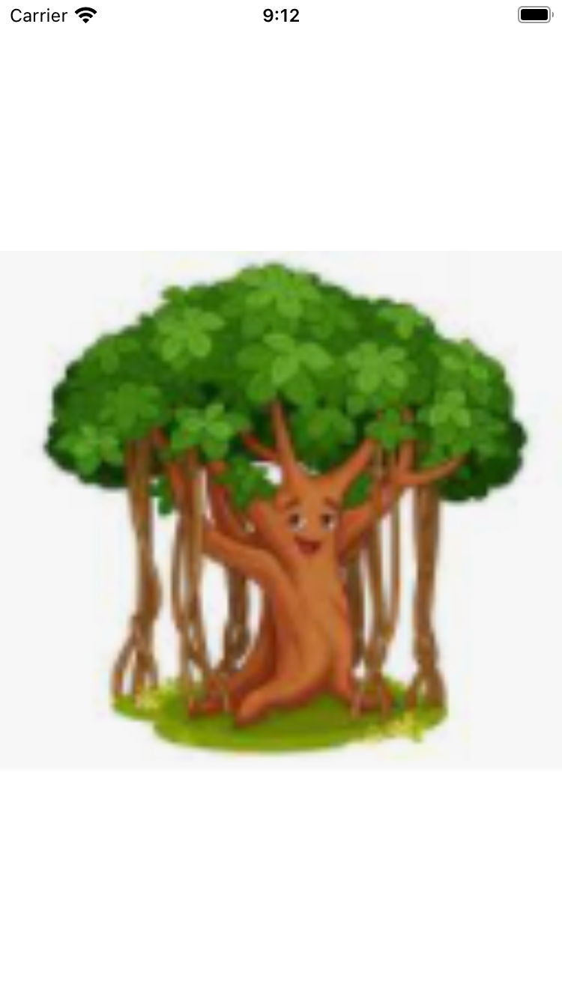
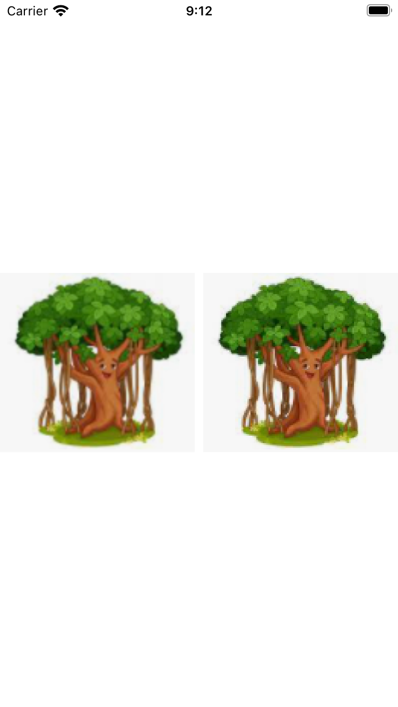
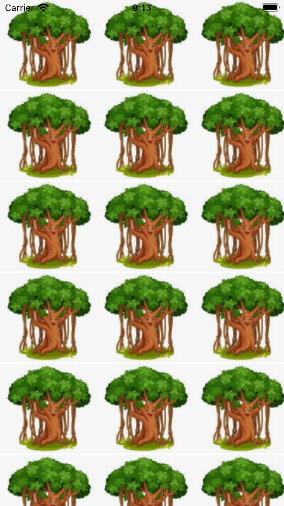
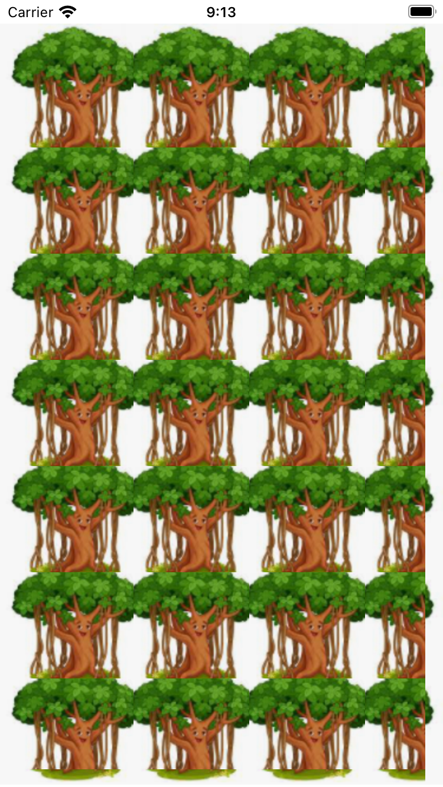

Để một image vào asset của bạn và hiển thị như sau

```swift
struct ImageGuide: View {
    var body: some View {
        Image("tree") // "tree" is name of your image in asset
    }
}
```

| Result      |
| :---        |
| {:height="50%" width="50%" .centered-image .img-left} |

Khi hiển thị một image trong asset bằng Image thì mặc định kích thước của Image view sẽ bằng với kích thước gốc của image. Bây giờ chúng ta sẽ thử set frame cho Image

```swift
struct ImageGuide: View {
    var body: some View {
        Image("tree")
            .border(Color.orange)
            .frame(width: 300, height: 300)
            .border(Color.blue)
    }
}
```

| Result      |
| :---        |
| {:height="50%" width="50%" .centered-image .img-left} |

Bạn sẽ thấy frame modifier không thể thay đổi được kích thước của Image, bởi vì Image sẽ tự set default kích thước bằng cách tính source bitmap. Chúng ta có thể thay đổi kích thước của nó bằng cách sử dụng modifier resizable như sau

```swift
struct ImageGuide: View {
    var body: some View {
        Image("tree")
            .resizable()
    }
}
```

| Result      |
| :---        |
| {:height="50%" width="50%" .centered-image .img-left} |

Modifier resizable sẽ làm cho Image fill tất cả các vùng trống mà không giữ aspect ratio. Để Image giữ lại aspect ratio chúng ta có thể sử dụng modifier ```.aspectRatio(contentMode: .fit)``` hoặc scaleToFit như sau

```swift
struct ImageGuide: View {
    var body: some View {
        Image("tree")
            .resizable()
            .scaledToFit()
    }
}
```

| Result      |
| :---        |
| {:height="50%" width="50%" .centered-image .img-left} |

Bạn có thể nhận thấy rằng Image sẽ bị làm mờ đi một ít khi bạn cố gắng resize nó lớn hơn kích thước gốc. Nó là do SwiftUI đã tự nội suy hình ảnh khi bạn cố kéo giãn bức ảnh ra nhiều lần.  
Bạn có thể loại bỏ phép nội suy này bằng cách sử dụng modifier interpolation như sau

```swift
struct ImageGuide: View {
    var body: some View {
        HStack {
            Image("tree")
                .resizable()
                .scaledToFit()
            Image("tree")
                .interpolation(.none)
                .resizable()
                .scaledToFit()
        }
    }
}
```

| Result      |
| :---        |
| {:height="50%" width="50%" .centered-image .img-left} |

SwiftUI có 2 cách để thay đổi kích thước của Image. Cách thứ 1 được gọi là stretching như chúng ta đã làm phía trên. Cách thứ 2 được gọi là tiled như phía dưới đây

```swift
struct ImageGuide: View {
    var body: some View {
        Image("tree")
            .resizable(resizingMode: .tile)
            .edgesIgnoringSafeArea(.all) // this modifier will make view ignore safe area
    }
}
```

| Result      |
| :---        |
| {:height="50%" width="50%" .centered-image .img-left} |

SwiftUI sẽ duplicate các bức ảnh theo dạng ô gạch, bạn có thể dùng cách này để fill cách vùng trống mà bạn muốn. Bạn cũng có thể chỉnh sửa kích thước vùng ảnh được duplicate bằng cách sử dụng capInsets như sau

```swift
struct ImageGuide: View {
    var body: some View {
        Image("tree")
            .resizable(
                capInsets: .init(
                    top: 15,
                    leading: 15,
                    bottom: 15,
                    trailing: 15
                ),
                resizingMode: .tile
            )
    }
}
```

| Result      |
| :---        |
| {:height="50%" width="50%" .centered-image .img-left} |

SwiftUI còn cho chúng ta được chọn cách render Image, một trong số đấy là original, nó sẽ loại bỏ tất cả các filter được add vào Image

```swift
struct ImageGuide: View {
    var body: some View {
        Image("tree")
            .renderingMode(.original)
    }
}
```
