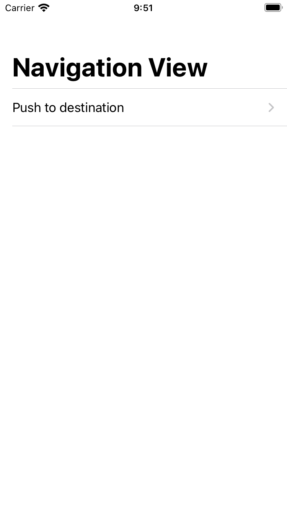
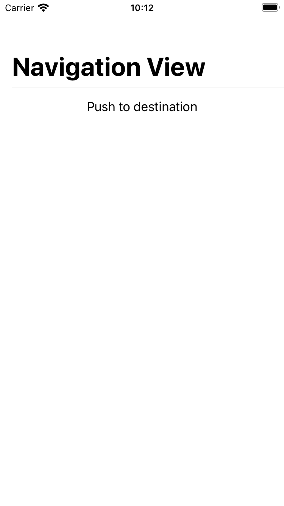

SwiftUI cung cấp cho chúng ta NavigationView và NavigationLink để có thể push view giống với Navigation bên phía UIKit

```swift
struct ContentView: View {    
    var body: some View {
        NavigationView {
            NavigationLink(
                destination: DestinationView(),
                label: {
                    Text("Push to destination")
                })
            .navigationTitle("Navigation View")
        }
    }
}

struct DestinationView: View {
    var body: some View {
        Text("Hello World!")
            .navigationTitle("Destination View")
    }
}
```

Nếu NavigationLink được đặt trong List thì sẽ tự động có icon mũi tên giống như hình dưới

```swift
struct ContentView: View {    
    var body: some View {
        NavigationView {
            List {
                NavigationLink(
                    destination: DestinationView(),
                    label: {
                        Text("Push to destination")
                    })
            }
            .navigationTitle("Navigation View")
        }
    }
}

```

| Result      |
| :---        |
| {:height="50%" width="50%" .centered-image .img-left} |

Nếu bạn muốn ẩn icon đấy đi thì cần phải dùng ZStack để đè một view khác lên và ẩn NavigationLink đi

```swift
struct ContentView: View {    
    var body: some View {
        NavigationView {
            List {
                ZStack {
                    Text("Push to destination")
                    NavigationLink(
                        destination: DestinationView(),
                        label: {
                            EmptyView()
                        }).opacity(.zero)
                }
            }
            .navigationTitle("Navigation View")
        }
    }
}
```

| Result      |
| :---        |
| {:height="50%" width="50%" .centered-image .img-left} |

Chúng ta còn có thể dùng biến binding để kiểm soát việc bao giờ push và pop view như sau

```swift
struct ContentView: View {
    @State private var isPushToDestination: Bool = false
    
    var body: some View {
        NavigationView {
            ZStack {
                NavigationLink(
                    destination: DestinationView(),
                    isActive: $isPushToDestination,
                    label: {
                        EmptyView()
                    }).hidden()
                Button(action: {
                    isPushToDestination.toggle()
                }, label: {
                    Text("Push to destination")
                })
            }
            .navigationTitle("Navigation View")
        }
    }
}
```

Bình thường khi NavigationLink được khởi tạo thì ngay lập tức destination view cũng được init ngay lúc đấy, vì vậy để tránh một số lỗi không đáng có khi sử dụng NavigationLink chúng ta có thể tạo ra NavigationLazyView như sau

```swift
struct NavigationLazyView<Content: View>: View {
    let build: () -> Content
    init(_ build: @autoclosure @escaping () -> Content) {
        self.build = build
    }
    var body: Content {
        build()
    }
}

struct ContentView: View {
    var body: some View {
        NavigationView {
            NavigationLink(
                destination: NavigationLazyView(DestinationView()),
                label: {
                    Text("Push to destination")
                })
            .navigationTitle("Navigation View")
        }
    }
}
```